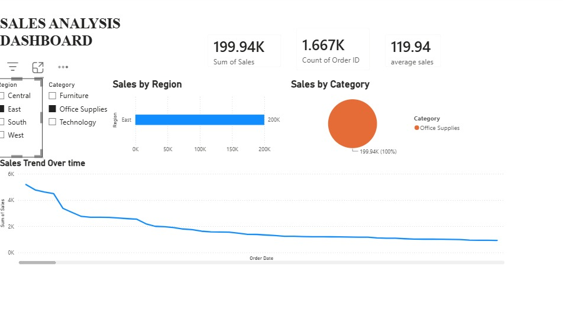
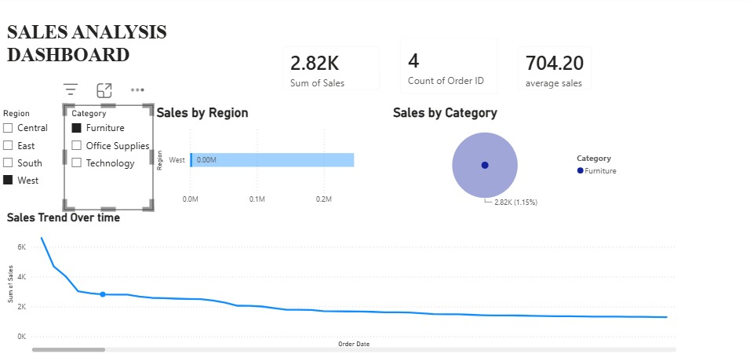
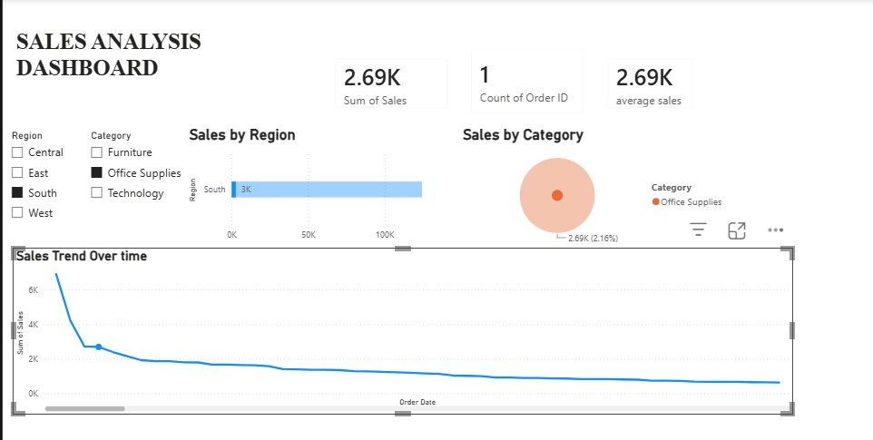

# Sales Analysis Dashboard 📊

**Tools:** Power BI, Excel  
**Dataset:** Retail Sales Data (Orders, Regions, Categories)

## Overview
Interactive Power BI dashboard analyzing retail sales performance 
across regions, categories, and time periods.

## Dashboard Preview

## Key Metrics
- 💰 Total Sales: 2.26M
- 📦 Total Orders: 9.8K
- 📈 Average Sales: 230.77

## Key Features
- Sales by Region — West, East, Central, South breakdown
- Sales by Category — Technology, Furniture, Office Supplies
- Sales Trend Over Time — order date based line chart
- Interactive filters for Region and Category
